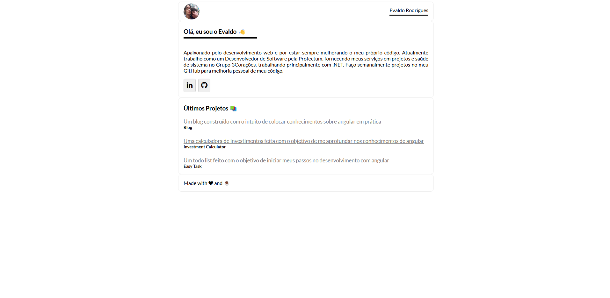

# Blog

<small>Finalizado✅</small>

**br:** Um blog **estático** construído com o intuito de colocar conhecimentos sobre angular em prática.<br/>
**en:** A **static** blog made to practice and learn more about angular.

## 🐋 Docker

**br:** Use os comandos abaixo para subir o container após clonar o repositório.  
**en:** Use the commands below to start the container after cloning the repository.

## 🚀 Subindo o container

```sh
docker-compose up --build -d
docker-compose down
```

## 📸 Demo


